<div align="center">

[](https://www.infnet.edu.br)
[](https://www.infnet.edu.br)
[-green?style=for-the-badge)](https://www.infnet.edu.br)

[](https://openjdk.org)
[](https://maven.apache.org)
[](https://junit.org/junit5)
[](https://jqwik.net)
[](https://www.jacoco.org)
[](LICENSE)
[](https://github.com/andrebecker84/refactoringDR4_TP3)

</div>

# E-Commerce Order Refactoring

## Trabalho Prático 3 — DR4 Refatoração

> **Refatoração de sistema legado de pedidos de e-commerce aplicando encapsulamento real, objetos de domínio, Hide Delegate e redistribuição de responsabilidades conforme SRP**

[](https://linkedin.com/in/becker84)
[](https://github.com/andrebecker84)

---

## Índice

- [Sobre o Projeto](#sobre-o-projeto)
- [Bad Smells Identificados](#bad-smells-identificados)
- [Métricas Antes e Depois](#métricas-antes-e-depois)
- [Arquitetura Após Refatoração](#arquitetura-após-refatoração)
- [Estrutura de Pacotes](#estrutura-de-pacotes)
- [Como Executar](#como-executar)
- [Testes](#testes)
- [Decisões Técnicas](#decisões-técnicas)
- [Documentação Completa](#documentação-completa)
- [Referências](#referências)

---

## Sobre o Projeto

Sistema legado responsável por gerar faturas e enviar e-mails de confirmação de pedidos. O código original concentrava dados do cliente, lógica de cálculo, formatação e chamada a serviço externo em uma única classe `Order` com atributos públicos e listas paralelas sem garantia de consistência.

A refatoração aplica sete técnicas de Fowler para eliminar os problemas estruturais sem alterar a lógica de negócio: o comportamento do sistema após a refatoração é idêntico ao original, verificado pelos testes automatizados.

---

## Bad Smells Identificados

| Bad Smell | Localização | Impacto |
|---|---|---|
| Atributos públicos sem controle | `Order.clientName`, `clientEmail`, `discountRate` | Qualquer código externo altera o estado sem validação |
| Listas paralelas | `products`, `quantities`, `prices` em `Order` | Nenhuma garantia de que os três índices permanecem sincronizados |
| Dados do cliente misturados com pedido | `clientName` e `clientEmail` em `Order` | SRP violado — `Order` tem duas razões para mudar |
| Lógica de cálculo embutida em método de exibição | `printInvoice()` calcula e imprime ao mesmo tempo | Impossível testar o cálculo sem efeito colateral de I/O |
| Acoplamento direto com infraestrutura | `Order.sendEmail()` chama `EmailService` diretamente | Trocar o mecanismo de envio exige alterar a classe de domínio |
| Raw types sem segurança de tipo | `List products`, `List quantities`, `List prices` | Erros de tipo são detectados apenas em runtime |

---

## Métricas Antes e Depois

| Métrica | Antes | Depois |
|---|---|---|
| Classes de domínio | 1 (`Order`) | 4 (`Client`, `Item`, `Order`, `DiscountPolicy`) |
| Atributos públicos de domínio | 6 | 0 |
| Listas paralelas | 3 | 0 |
| Responsabilidades em `Order` | 4 (dados, cálculo, formatação, notificação) | 1 (gerenciar itens e expor totais) |
| Acoplamento `Order` → `EmailService` | Direto | Eliminado |
| Testes automatizados | 0 | 17 (JUnit 5 + Jqwik) |
| Cobertura de domínio (JaCoCo) | — | > 90% |

---

## Arquitetura Após Refatoração

```
App (main)
  │
  ├── Order ──────────────── Client
  │     │                    (nome, e-mail encapsulados)
  │     │
  │     ├── List<Item>
  │     │     (produto, qtd, preço, subtotal)
  │     │
  │     └── DiscountPolicy
  │           (taxa, discountAmount, finalTotal)
  │
  ├── InvoicePrinter ──────── Order
  │     (formatação da fatura)
  │
  └── EmailNotifier ────────── EmailService (infrastructure)
        (notificação de pedido)
```

Cada camada depende apenas das camadas internas. `Order` não conhece nem `InvoicePrinter` nem `EmailNotifier`. `EmailNotifier` é o único ponto de acesso ao `EmailService` de infraestrutura.

---

## Estrutura de Pacotes

```
src/
└── main/java/com/andrebecker/ecommerce/
│   ├── App.java                        # entrada principal com avaliação de design
│   ├── original/
│   │   └── App.java                    # código legado preservado intacto
│   ├── domain/
│   │   ├── Client.java                 # identidade do comprador
│   │   ├── Item.java                   # produto, quantidade, preço e subtotal
│   │   ├── Order.java                  # agregação de itens e cálculo de totais
│   │   └── DiscountPolicy.java         # política de desconto isolada
│   ├── service/
│   │   ├── InvoicePrinter.java         # formatação e impressão da fatura
│   │   └── EmailNotifier.java          # delegação ao serviço de e-mail
│   └── infrastructure/
│       └── EmailService.java           # serviço externo (inalterado)
└── test/java/com/andrebecker/ecommerce/domain/
    ├── ItemTest.java                   # 7 testes determinísticos de Item
    ├── OrderTest.java                  # 7 testes determinísticos de Order
    └── OrderPropertyTest.java          # 3 propriedades Jqwik
```

---

## Como Executar

**Pré-requisitos:** JDK 21+, Maven 3.9+

```bash
# Build completo + cobertura JaCoCo
mvn clean verify

# Apenas testes
mvn test

# Compilar sem testes
mvn clean compile
```

**Scripts interativos:**

```bash
# Windows
run.bat

# Linux / macOS
chmod +x run.sh && ./run.sh
```

Relatório JaCoCo gerado em `target/site/jacoco/index.html`.

---

## Testes

**17 testes no total — 0 falhas.**

### Testes Determinísticos (JUnit 5 + Hamcrest)

| Teste | Cobertura |
|---|---|
| `subtotalIsQuantityTimesPrice` | subtotal = qty × price |
| `subtotalWithUnitQuantityEqualsPrice` | qty = 1 → subtotal = price |
| `subtotalWithDecimalPrice` | precisão com valores decimais |
| `constructorRejectsZeroQuantity` | Fail-Fast: quantidade zero |
| `constructorRejectsNegativeQuantity` | Fail-Fast: quantidade negativa |
| `constructorRejectsNegativePrice` | Fail-Fast: preço negativo |
| `constructorRejectsBlankProduct` | Fail-Fast: produto em branco |
| `grossTotalSumsAllItemSubtotals` | total bruto com múltiplos itens |
| `discountAmountIsRateAppliedToGrossTotal` | desconto = total × taxa |
| `finalTotalIsGrossTotalMinusDiscount` | total final = subtotal − desconto |
| `finalTotalCoherentWithGrossTotalAndDiscountRate` | coerência total final × taxa |
| `itemsListIsImmutable` | coleção interna não é modificável externamente |
| `constructorRejectsNullClient` | Fail-Fast: cliente nulo |
| `constructorRejectsNullDiscountPolicy` | Fail-Fast: política nula |

### Testes Baseados em Propriedades (Jqwik — 1000 verificações cada)

| Propriedade | Invariante |
|---|---|
| `grossTotalEqualsSum` | `totalBruto == Σ(qty × price)` para qualquer conjunto de itens válidos |
| `finalTotalLessThanGrossTotalWhenDiscountPositive` | `totalFinal < subtotal` quando `discountRate > 0` |
| `itemSubtotalNeverNegative` | subtotal de `Item` nunca negativo para valores válidos |

---

## Decisões Técnicas

**Exercício 1 e 2 — Encapsulamento e objetos de domínio**
As três listas paralelas (`products`, `quantities`, `prices`) foram substituídas por `List<Item>`. `Item` encapsula os três valores com validação no construtor e calcula o próprio `subtotal()`. A eliminação das listas paralelas remove a possibilidade de inconsistência de índice, que era estruturalmente impossível de detectar pelo compilador.

**Exercício 3 — Hide Delegate**
`Order.sendEmail()` chamava `EmailService` diretamente, criando acoplamento entre domínio e infraestrutura. `EmailNotifier` encapsula essa chamada. `Order` não conhece mais `EmailService` — trocar o canal de envio não exige nenhuma alteração nas classes de domínio.

**Exercício 4 — Move Method e SRP**
`printInvoice()` calculava e formatava no mesmo método, misturando cálculo (responsabilidade de `Order`) com apresentação (responsabilidade de `InvoicePrinter`). Os métodos foram redistribuídos: `grossTotal()`, `discountAmount()` e `finalTotal()` pertencem a `Order` e `DiscountPolicy`; `InvoicePrinter` apenas formata.

**Exercício 5 — Extract Class (Client)**
`clientName` e `clientEmail` eram atributos de `Order`, violando SRP. `Client` encapsula esses dados com validação própria. `Order` passa a receber um `Client`, tornando o modelo mais expressivo e eliminando strings soltas no construtor do pedido.

**Exercício 6 — Extract Method**
`printInvoice()` original iterava, calculava e imprimia em sequência linear. `InvoicePrinter` decompõe em `printHeader()`, `printLineItems()`, `printLineItem()` e `printTotals()` — cada método com intenção única e nome descritivo.

**Exercício 7 — Fail-Fast e código morto**
Validações no construtor de todas as classes de domínio garantem que objetos inválidos não chegam ao domínio. O padrão `DiscountPolicy.calculateDiscount()` estático foi convertido em métodos de instância com estado real (`rate`), eliminando o anti-padrão de classe utilitária sem identidade.

**Composição sobre herança**
Todas as classes são `final`. Não há hierarquia de herança, o que elimina qualquer possibilidade de violação de LSP. A extensibilidade é obtida por substituição de `DiscountPolicy` ou `EmailNotifier` sem alterar as classes que os recebem.

---

## Documentação Completa

Análise detalhada de cada refatoração, trechos antes/depois e justificativa técnica:

[`doc/TP3_RELATORIO.md`](doc/TP3_RELATORIO.md)

---

## Referências

- MARTIN, Robert C. *Clean Code: A Handbook of Agile Software Craftsmanship*. 2. ed. Prentice Hall, 2008.
- FOWLER, Martin. *Refactoring: Improving the Design of Existing Code*. 2. ed. Addison-Wesley, 2018.
- BECK, Kent. *Test Driven Development: By Example*. Addison-Wesley, 2002.
- [JUnit 5 User Guide](https://junit.org/junit5/docs/current/user-guide/)
- [Jqwik Documentation](https://jqwik.net/docs/current/user-guide.html)
- [JaCoCo Documentation](https://www.jacoco.org/jacoco/trunk/doc/)

---

<div align="center">

<p><strong>Desenvolvido como Trabalho Prático da disciplina de Engenharia de Software com foco em Refatoração.</strong></p>

<p>
  <a href="https://www.java.com/"></a>
  <a href="https://maven.apache.org/"></a>
  <a href="https://junit.org/junit5/"></a>
</p>

<a href="doc/images/card.svg">
  
</a>

<p><em>Instituto Infnet — Engenharia de Software — 2026.</em></p>

<p>
  <a href="LICENSE"></a>
</p>

</div>